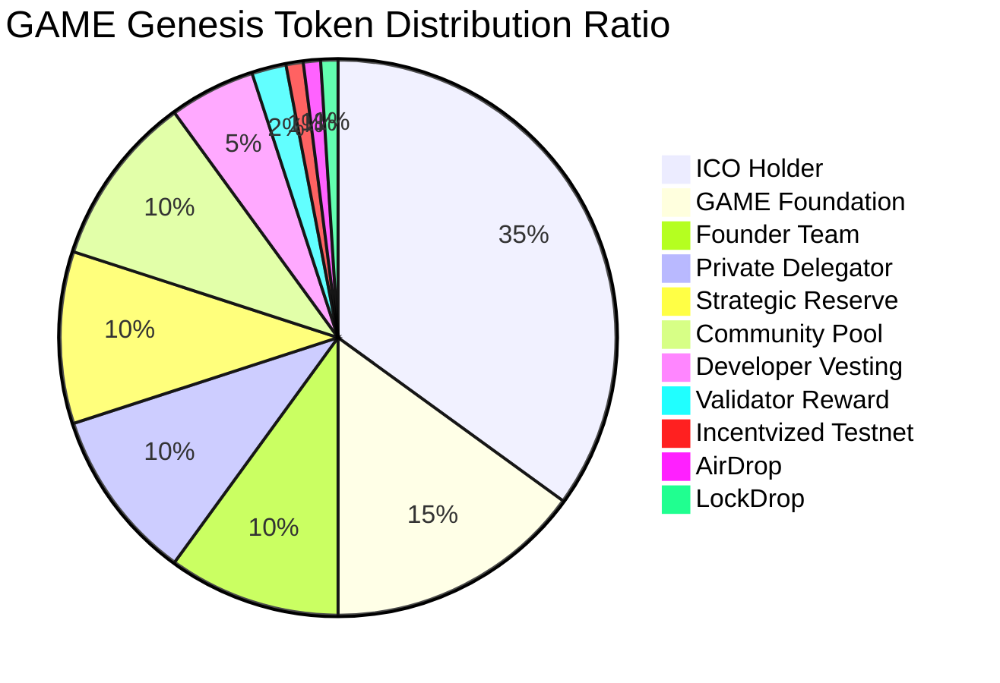
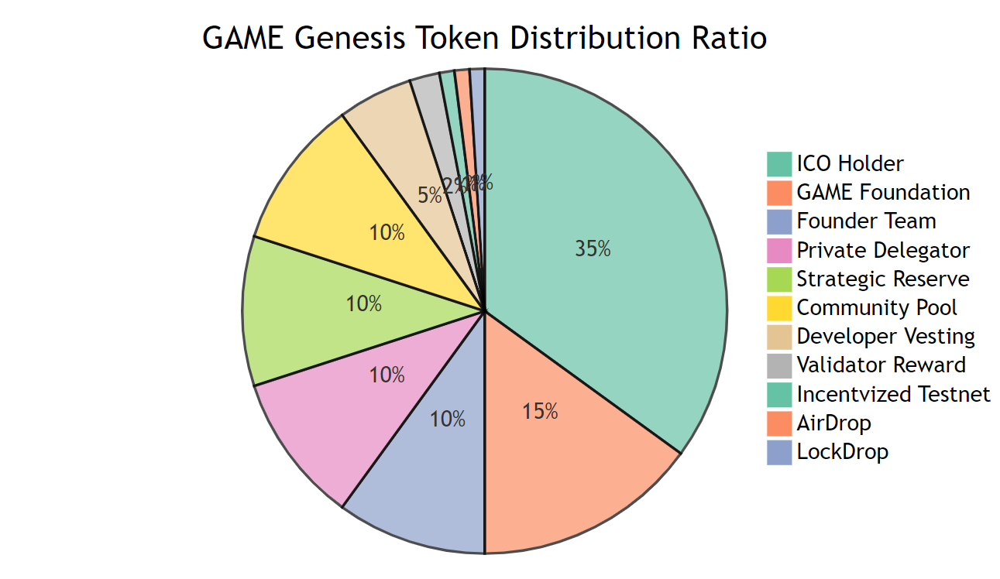

## Parameter

param                  | default              | new value
-----------------------| ---------------------|---------------------
denom                  | stake                | ugame
signed_blocks_window   | 100                  | 10000
min_signed_per_window  | 0.500000000000000000 | 0.050000000000000000
slash_fraction_downtime| 0.010000000000000000 | 0.000100000000000000
voting_period          | 172800s              | 1209600s
max_deposit_period     | 172800s              | 1209600s
min_deposit            | 10000000             | 1000000000
inflation              | 0.130000000000000000 | 1.0
inflation_rate_change  | 0.130000000000000000 | 1.0
inflation_max          | 0.200000000000000000 | 1.0
inflation_min          | 0.070000000000000000 | 0.125000000000000000
goal_bonded            | 0.670000000000000000 | 0.340000000000000000
send_enabled           | true                 | false
receive_enabled        | true                 | false

* `total supply` at the genesis is 200000000GAME
* `ugame` is the network's denom
* Validators have to sign at least 5% of the latest 10000 blocks. Otherwise, 0.01% of bonded token will be slashed
* Validators must avoid double signing. Otherwise 5% of bonded token will be slashed
* `voting period` and `max deposit period` is 2weeks
* Minimum deposit amount is 1000GAME
* Inflation rate is 100% in the initial year
* Inflation rate will be changed to 50%, 25%, 12.5% for every other year
* Minimum inflation rate is 12.5%
* IBC transfer is disabled at the genesis, it will be enabled through the governance voting

## Token Distribution
<!---

-->

  

Incentvized Testnet/ AirDrop/ LockDrop are all 1% of total supply. 

Please check the detil about token distribution in [our Medium article](https://medium.com/game/game-token-distribution-37f5f7cacc9).
